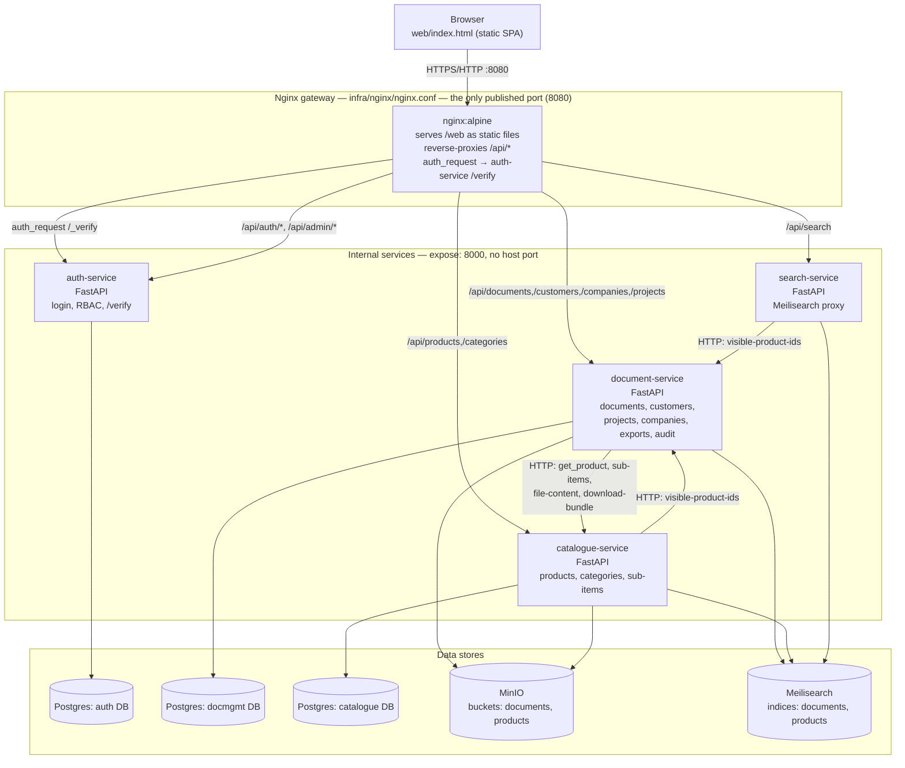
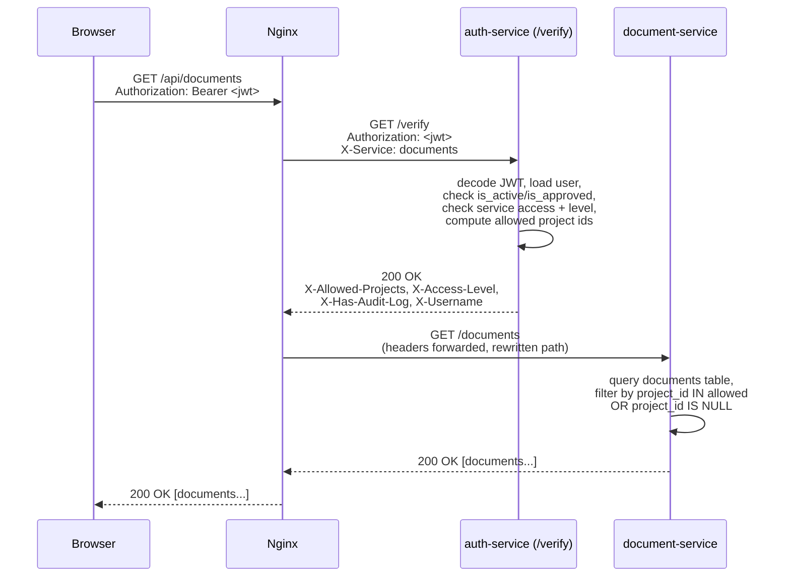
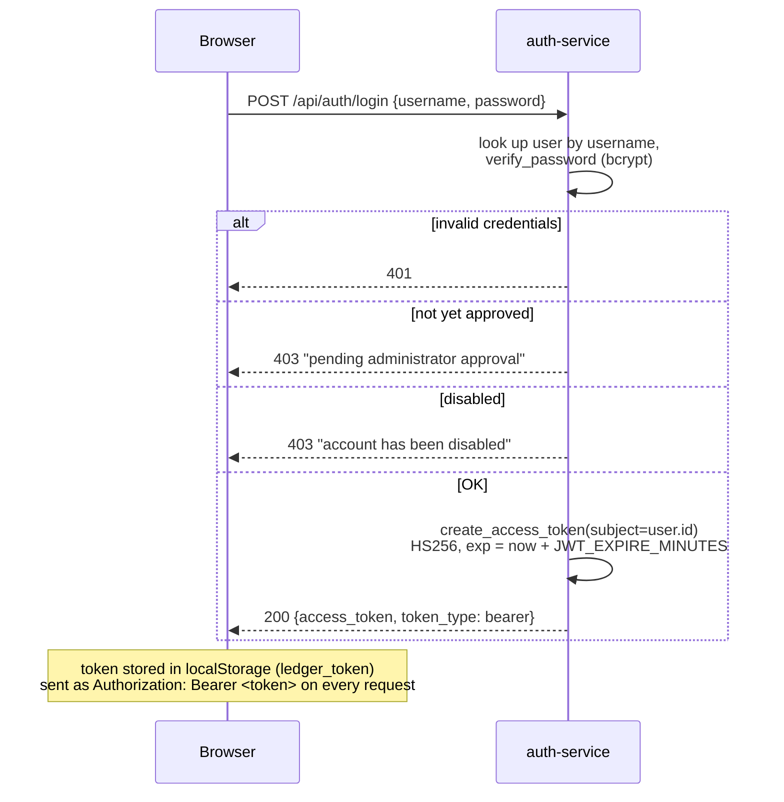
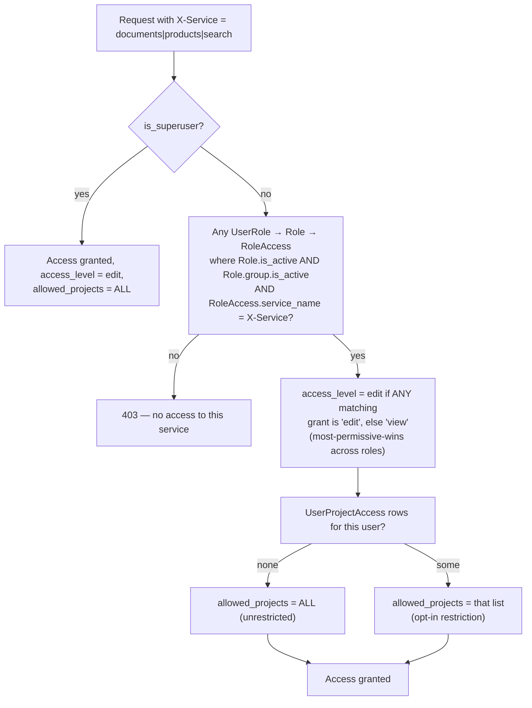
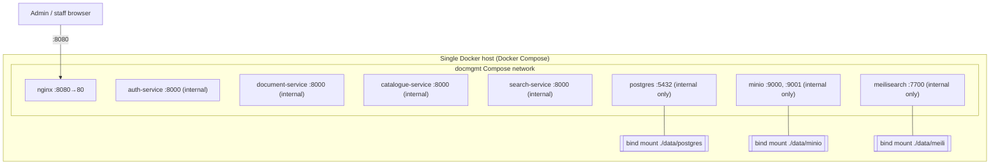

# Architecture

## System architecture

Key structural facts, all verifiable in `infra/docker-compose.yml` and
`infra/nginx/nginx.conf`:

- **Nginx is the single trust boundary.** Every browser request goes through
  it; internal services (`auth-service`, `document-service`,
  `catalogue-service`, `search-service`) have no published host port and are
  only reachable on the Docker Compose network.
- **Downstream services trust Nginx's forwarded headers unconditionally.**
  `document-service`, `catalogue-service`, and `search-service` read
  `X-Allowed-Projects`, `X-Access-Level`, `X-Has-Audit-Log`,
  `X-Has-Category-Access`, and `X-Username` directly off the request with no
  independent verification — these are only meaningful because Nginx's
  `auth_request` step populated them from `auth-service`'s `/verify`
  response first (`infra/nginx/nginx.conf:75-159`). Any direct,
  non-gateway access to a service's port would bypass authorization
  entirely — see [known-issues.md](known-issues.md).
- **No message queue, cache layer, or event bus.** Confirmed absent by
  repository-wide search — no Redis, Celery, RabbitMQ, or Kafka client in
  any `requirements.txt` (a stray `infra/data/redis/` entry in `.gitignore`
  suggests Redis was considered at some point but never implemented).
- **Search indexing is synchronous and best-effort.** Each write to a
  document or product calls Meilisearch inline, in the same request, and
  swallows failures (logs only) — see `app/core/search_client.py` in both
  `document-service` and `catalogue-service`.

## Request flow

Every protected API call follows the same shape. Example: `GET /api/documents`.

If `/verify` returns `401` (missing/invalid/expired token) or `403` (valid
token, no access to that service), Nginx's `auth_request` short-circuits and
the downstream service is never called (`infra/nginx/nginx.conf:24-31`,
`services/auth-service/app/routers/auth.py:113-171`).

A handful of routes skip `auth_request` entirely because they are public or
self-authorizing:

- `POST /api/auth/login`, `POST /api/auth/register`, `GET
  /api/auth/groups-public` — public, no token needed
  (`infra/nginx/nginx.conf:34-54`).
- `/api/auth/users`, `/api/admin/*` — proxied straight to `auth-service`
  with only the raw `Authorization` header forwarded; `auth-service`'s own
  route handlers (`app/core/deps.py`, `app/routers/admin.py`) perform the
  JWT decode and permission checks themselves
  (`infra/nginx/nginx.conf:56-71`).

## Authentication flow

Notable details:

- The JWT `sub` claim is the user's **immutable UUID**, not their username
  (`services/auth-service/app/routers/auth.py:109`,
  `app/core/jwt_utils.py:8-11`) — this was a deliberate fix (commit
  `b6687c9`) so that renaming a user cannot cause a still-valid old token to
  resolve to a different account.
  Access token lifetime defaults to 60 minutes
  (`app/core/config.py:16`, `JWT_EXPIRE_MINUTES`). **There is no refresh
  token or revocation list** — a token remains valid until it expires, even
  if the user is disabled *after* issuance, except that
  `get_current_user`/`/verify` re-check `is_active`/`is_approved` on every
  request, so a disabled user is denied on their very next call even with
  an unexpired token (`app/core/deps.py:35-38`,
  `app/routers/auth.py:152-156`).
- Passwords are hashed with bcrypt via passlib
  (`app/core/security.py`); the JWT secret and algorithm are configured via
  `JWT_SECRET` / `JWT_ALGORITHM` (default `HS256`) in
  `app/core/config.py:14-15`. `main.py:23-28` logs a startup warning if the
  default insecure `JWT_SECRET` is still in use.
- On first boot, if the `users` table is completely empty, a superuser is
  seeded from `SEED_ADMIN_USERNAME`/`SEED_ADMIN_PASSWORD`
  (`app/main.py:37-54`).

## Permission (authorization) flow

This logic lives entirely in `services/auth-service/app/core/authz.py`
(`user_has_service_access`, `get_user_access_level`,
`get_user_allowed_project_ids`) and is evaluated fresh on every `/verify`
call — there is no caching of permission decisions. See
[workflows.md](workflows.md#permission-model) for the full group/role/grant
data model and [data-model.md](data-model.md) for the schema.

## Deployment diagram

See [deployment.md](deployment.md) for the full container table, port list,
and environment variable reference.
