# Data Model

There are **three separate PostgreSQL databases on one Postgres 16 server**
(database-per-service): `auth`, `catalogue`, and `docmgmt` (document-service's
database — note it is *not* named `document` or `documents`;
`services/document-service/app/core/config.py:5`). There are **no
cross-database foreign keys** — every cross-service reference (a project ID
stored in auth-service, a product ID stored in a document-service line item,
a category name stored on a product) is a plain unconstrained
UUID/string, resolved at request time via an HTTP call to the owning service.
This is a deliberate, repeatedly-commented design choice — see
[decisions.md](decisions.md).

## Entity Relationship Diagram

```mermaid
erDiagram
    %% ---------- auth DB ----------
    USERS ||--o{ USER_GROUPS : "member of"
    USERS ||--o{ USER_ROLES : "assigned"
    USERS ||--o{ USER_PROJECT_ACCESS : "granted"
    GROUPS ||--o{ USER_GROUPS : has
    GROUPS ||--o{ ROLES : owns
    GROUPS ||--o{ GROUP_PROJECT_ACCESS : "pool of"
    ROLES ||--o{ ROLE_ACCESS : grants
    ROLES ||--o{ ROLE_PROJECT_ACCESS : grants
    ROLES ||--o{ USER_ROLES : "assigned to"
    USERS ||--o{ GROUPS : "requested_group_id (nullable, SET NULL)"

    USERS {
        uuid id PK
        string username UK
        string hashed_password
        bool is_superuser
        bool is_approved
        bool is_active
        uuid requested_group_id FK "nullable, ON DELETE SET NULL"
        datetime created_at
    }
    GROUPS {
        uuid id PK
        string name UK
        bool is_active
        datetime created_at
    }
    USER_GROUPS {
        uuid id PK
        uuid user_id FK "ON DELETE CASCADE"
        uuid group_id FK "ON DELETE CASCADE"
        bool is_group_admin
    }
    ROLES {
        uuid id PK
        string name "unique per group_id"
        uuid group_id FK "ON DELETE CASCADE"
        bool is_active
        datetime created_at
    }
    ROLE_ACCESS {
        uuid id PK
        uuid role_id FK "ON DELETE CASCADE, unique per service_name"
        string service_name "documents|products|search|audit-log|categories"
        string access_level "view|edit"
    }
    ROLE_PROJECT_ACCESS {
        uuid id PK
        uuid role_id FK "ON DELETE CASCADE, unique per project_id"
        uuid project_id "unenforced ref to document-service Project — LEGACY, superseded by USER_PROJECT_ACCESS"
    }
    GROUP_PROJECT_ACCESS {
        uuid id PK
        uuid group_id FK "ON DELETE CASCADE, unique per project_id"
        uuid project_id "unenforced ref to document-service Project"
    }
    USER_PROJECT_ACCESS {
        uuid id PK
        uuid user_id FK "ON DELETE CASCADE, unique per project_id"
        uuid project_id "unenforced ref to document-service Project"
    }
    USER_ROLES {
        uuid id PK
        uuid user_id FK "ON DELETE CASCADE, unique per role_id"
        uuid role_id FK "ON DELETE CASCADE"
    }

    %% ---------- catalogue DB ----------
    PRODUCTS ||--o{ PRODUCT_SUB_ITEMS : "parent_product_id"
    PRODUCTS ||--o{ PRODUCT_SUB_ITEMS : "sub_product_id (no FK cascade)"
    CATEGORIES ||--o{ PRODUCTS : "category (string, unenforced)"

    PRODUCTS {
        uuid id PK
        string sku UK
        bool is_deleted
        string name
        string description
        string category "plain string, not FK"
        numeric unit_price
        string currency
        string remark
        jsonb attributes
        string image_object_key
        datetime created_at
        datetime updated_at
    }
    CATEGORIES {
        uuid id PK
        string name UK
        string short_term UK "SKU prefix"
        string description
        datetime created_at
    }
    PRODUCT_SUB_ITEMS {
        uuid id PK
        uuid parent_product_id FK "ON DELETE CASCADE, unique per sequence_number"
        uuid sub_product_id FK "no ON DELETE action"
        int sequence_number
        datetime created_at
    }

    %% ---------- docmgmt DB ----------
    CUSTOMERS ||--o{ DOCUMENTS : "customer_id"
    PROJECTS ||--o{ DOCUMENTS : "project_id"
    COMPANIES ||--o{ DOCUMENTS : "company_id"
    COMPANIES ||--o{ COMPANY_DIRECTORS : "company_id (CASCADE)"
    COMPANY_DIRECTORS ||--o{ DOCUMENTS : "director_id"
    DOCUMENTS ||--o{ LINE_ITEMS : "document_id (CASCADE)"
    DOCUMENTS ||--o{ AUDIT_LOG_ENTRIES : "document_id (CASCADE)"

    CUSTOMERS {
        uuid id PK
        string name
        string email
        string phone
        jsonb billing_address
        bool is_deleted
        datetime created_at
    }
    PROJECTS {
        uuid id PK
        string name
        string budget_year
        text description
        bool is_deleted
        datetime created_at
    }
    COMPANIES {
        uuid id PK
        string name
        string short_name "doc number prefix"
        string logo_object_key
        string seal_object_key
        bool is_primary
        bool is_deleted
        datetime created_at
    }
    COMPANY_DIRECTORS {
        uuid id PK
        uuid company_id FK "ON DELETE CASCADE"
        string name
        text address
        string contact_no
        string email
        string seal_object_key "distinct from the company's own seal"
        int sort_order
        datetime created_at
    }
    DOCUMENTS {
        uuid id PK
        string doc_type "quotation|invoice|proposal|catalogue"
        bool is_deleted
        string doc_number UK
        uuid customer_id FK "nullable, no ON DELETE action"
        uuid project_id FK "nullable, no ON DELETE action"
        uuid company_id FK "nullable, no ON DELETE action"
        uuid director_id FK "which MD's name/address/contact/email/seal to show — must belong to company_id"
        string status "draft|sent|paid|void|expired"
        string currency "USD|MMK"
        numeric subtotal
        numeric tax_total
        numeric total
        date issue_date
        date due_date
        jsonb metadata
        text terms_and_conditions
        string file_object_key
        int version "defined, NEVER incremented anywhere — dead field"
        datetime created_at
        datetime updated_at
    }
    LINE_ITEMS {
        uuid id PK
        uuid document_id FK "ON DELETE CASCADE"
        uuid product_id "unenforced ref to catalogue-service Product"
        int sort_order
        text description
        string remark
        string unit
        numeric quantity
        numeric unit_price
        numeric tax_rate
        numeric line_total
    }
    AUDIT_LOG_ENTRIES {
        uuid id PK
        uuid document_id FK "ON DELETE CASCADE"
        string username
        string action "created|viewed|edited|status_changed|file_uploaded"
        datetime created_at
    }
```

## Databases and ownership

| Database | Service | Tables |
|---|---|---|
| `auth` | auth-service | `users`, `groups`, `user_groups`, `roles`, `role_access`, `role_project_access`, `group_project_access`, `user_project_access`, `user_roles` |
| `catalogue` | catalogue-service | `products`, `categories`, `product_sub_items` |
| `docmgmt` | document-service | `customers`, `projects`, `companies`, `documents`, `line_items`, `audit_log_entries` |

All three databases live on the single `postgres` container/server defined
in `infra/docker-compose.yml`. `docmgmt` is created automatically by
Postgres from the `POSTGRES_DB` env var; `catalogue` and `auth` are created
by the bootstrap scripts in `infra/init-db/` (`01-create-catalogue-db.sql`,
`02-create-auth-db.sql`), which only run on the *very first* container
startup with an empty data volume.

## Table descriptions, keys, and constraints

### auth DB

- **`users`** (`app/models.py:11-25`) — PK `id` (UUID). `username` unique,
  not null. `hashed_password` bcrypt. `is_superuser`, `is_approved`,
  `is_active` booleans (default `False`, `False`, `True` respectively —
  new accounts require approval before they can log in).
  `requested_group_id` → `groups.id`, nullable, `ON DELETE SET NULL` (so
  deleting a group doesn't delete pending registrants, just clears their
  request).
- **`groups`** — PK `id`. `name` unique. `is_active` (default `True`) — a
  disabled group behaves as if every role in it were disabled
  (`app/core/authz.py:27-30`).
- **`user_groups`** — join table for membership, PK `id` (a surrogate key,
  not a composite PK). Unique constraint `(user_id, group_id)`. Carries
  `is_group_admin` per membership (a user can be admin of one group and a
  plain member of another). Both FKs `ON DELETE CASCADE`.
- **`roles`** — PK `id`. Belongs to exactly one `group_id`
  (`ON DELETE CASCADE`). Unique constraint `(name, group_id)` — role names
  only need to be unique *within* a group. `is_active` default `True`.
- **`role_access`** — PK `id`. `role_id` → `roles.id` (`CASCADE`). Unique
  `(role_id, service_name)`. `service_name` is a free-text string
  constrained only at the application layer to `{documents, products,
  search, audit-log, categories}` (`VALID_SERVICES`,
  `app/routers/admin.py:16`) — **no DB check constraint or enum**.
  `access_level` (`view`/`edit`, default `edit`) is only actually
  interpreted for the `documents` service; other services ignore the level
  and treat any grant as full access (`app/models.py:71-86` docstring).
- **`role_project_access`** — PK `id`. `role_id` → `roles.id` (`CASCADE`).
  Unique `(role_id, project_id)`. `project_id` is a bare UUID with **no
  foreign key** (it references document-service's `projects` table, a
  different database). The model's own docstring
  (`app/models.py:88-96`) says this is **legacy**, superseded by
  `user_project_access` — confirmed by the fact that no router in
  `admin.py` reads or writes this table; only the model and its unique
  constraint exist. Treat it as inert/dead schema (see
  [known-issues.md](known-issues.md)).
- **`group_project_access`** — PK `id`. `group_id` → `groups.id`
  (`CASCADE`). Unique `(group_id, project_id)`. The "pool" a superuser
  grants to a whole group; a group admin may only re-grant projects
  already in this pool to individual users.
- **`user_project_access`** — PK `id`. `user_id` → `users.id` (`CASCADE`).
  Unique `(user_id, project_id)`. The actual, currently-used per-user
  project visibility grant. **No rows for a user = unrestricted** (opt-in
  restriction philosophy, `app/core/authz.py:83-98`).
- **`user_roles`** — PK `id`. Unique `(user_id, role_id)`. Both FKs
  `CASCADE`.

### catalogue DB

- **`products`** (`app/models.py:10-25`) — PK `id`. `sku` unique, not
  null. `is_deleted` indexed (soft-delete filter is on nearly every
  query). `category` indexed but a **plain string**, not an FK to
  `categories.name` — renaming a category requires an explicit
  cascading `UPDATE` in application code
  (`app/routers/categories.py:78-85`). `attributes` is a free-form JSONB
  bag for per-category custom fields. `image_object_key` points into the
  `products` MinIO bucket.
- **`categories`** — PK `id`. `name` unique. `short_term` unique (used as
  the SKU prefix, e.g. "COM") — uniqueness matters because two categories
  sharing a prefix would generate colliding SKUs
  (`app/models.py:40` comment).
- **`product_sub_items`** — PK `id`. `parent_product_id` → `products.id`
  (`CASCADE`, indexed). `sub_product_id` → `products.id` with **no
  `ondelete`** specified — deleting a product that is referenced as
  someone else's sub-item will fail with a raw FK violation rather than
  cascading or nulling (see [known-issues.md](known-issues.md)). Unique
  `(parent_product_id, sequence_number)`; sequence numbers are
  renumbered contiguously after any removal
  (`app/routers/products.py:470-482`).

### docmgmt DB (document-service)

- **`customers`**, **`projects`**, **`companies`** — each has a UUID PK,
  an `is_deleted` boolean (indexed), and `created_at`. `companies` also
  has `is_primary` (only one company may be primary at a time, enforced
  in application code by unsetting all others whenever one is set —
  `app/routers/companies.py:100-107, 152-153` — **not a DB constraint**).
- **`documents`** — PK `id`. `doc_number` unique, not null,
  auto-generated as `{company.short_name or "DOC"}-{YYYYMMDD}/{seq:03d}`
  per company+day (`app/routers/documents.py:108-132`). `customer_id`,
  `project_id`, `company_id` → their respective tables, all nullable,
  **no `ondelete` clause** (so those FKs default to `RESTRICT` in
  Postgres — this is *why* `companies.py`/`customers.py`/`projects.py`
  catch `IntegrityError` on hard delete and return a friendly 400 instead
  of a raw 500, e.g. `app/routers/companies.py:212-220`). `status`
  constrained at the application layer to `VALID_STATUSES = {draft, sent,
  paid, void, expired}` (`app/routers/documents.py:36`) — no DB enum.
  `metadata` (mapped from column name `metadata` to attribute
  `doc_metadata` since `metadata` is reserved on SQLAlchemy's `Base`) is
  free-form JSONB, GIN-indexed
  (`alembic/versions/0001_initial.py:90-92`). **`version` defaults to 1
  and is never written to anywhere in the codebase** — confirmed by
  repository-wide search; the column exists but no versioning workflow is
  implemented (see [known-issues.md](known-issues.md) and
  [workflows.md](workflows.md#versioning-workflow)).
- **`line_items`** — PK `id`. `document_id` → `documents.id`
  (`CASCADE` — deleting a document deletes its line items). `product_id`
  is a bare UUID with **no FK** (cross-database reference into
  catalogue-service's `products` table), indexed for the
  `visible-product-ids` and `by-product` lookups.
- **`audit_log_entries`** — PK `id`. `document_id` → `documents.id`
  (`CASCADE`, not null). `username` stored as a plain string snapshot
  (not a FK to auth-service's `users`, since document-service has no
  access to that database) — `action` is one of `created`, `viewed`,
  `edited`, `status_changed`, `file_uploaded`, enforced only by the
  literal strings passed at each call site
  (`app/routers/documents.py`), not a DB constraint.

## Indexes

Beyond the primary/unique-constraint indexes listed above, the initial
Alembic migration (`services/document-service/alembic/versions/0001_initial.py`)
creates:

- `documents`: `idx_documents_customer` (`customer_id`),
  `idx_documents_project` (`project_id`), `idx_documents_company`
  (`company_id`), `idx_documents_type_status` (`doc_type, status`
  composite), `ix_documents_is_deleted`, `idx_documents_metadata` (GIN,
  on the `metadata`/`doc_metadata` JSONB column).
- `line_items`: `idx_line_items_document` (`document_id`),
  `idx_line_items_product` (`product_id`).
- `audit_log_entries`: `idx_audit_log_document` (`document_id`).
- `customers`, `projects`, `companies`: `ix_*_is_deleted`.

`add_performance_indexes.sql` (repo root) is a **separate, manually-run**
script — not part of any migration chain — that (re-)creates a subset of
these on `documents`/`line_items` and adds two that the Alembic migration
does not cover: `ix_products_is_deleted` and `ix_products_category` on
`catalogue`'s `products` table. It is idempotent (`CREATE INDEX IF NOT
EXISTS`) and must be applied by hand against each database
(`add_performance_indexes.sql:1-10`) — it is not run automatically by
`docker compose up`, a migration, or any startup hook.

`catalogue-service`'s own models declare `index=True` directly on
`Product.is_deleted`, `Product.category`, and
`ProductSubItem.parent_product_id` (`app/models.py:15,18,58`) — since
catalogue-service has no Alembic migrations at all, these indexes are only
created if you run `Base.metadata.create_all()` fresh (a brand-new
database) or apply `add_performance_indexes.sql` by hand against an
existing one.

`auth-service` has **no explicit indexes beyond primary/unique keys** in
its models — no covering index on `user_groups.user_id`,
`user_roles.user_id`, etc. beyond what the unique constraints incidentally
provide.

## Migration order

Only **document-service** has Alembic wired up
(`services/document-service/alembic/`), with a single migration:

1. `0001_initial` (`down_revision: None`) — creates `customers`, `projects`,
   `companies`, `documents`, `line_items`, `audit_log_entries` and all
   their indexes, matching the current `models.py` (rewritten in commit
   `b6687c9` to fix a prior mismatch — it originally predated
   `companies`/`projects`/`audit_log_entries` and had a
   `document_items`/`line_items` naming bug).

**This migration is not actually applied anywhere at runtime.**
`app/main.py:16-20` in document-service explicitly calls
`Base.metadata.create_all(bind=engine)` instead of running Alembic, with a
comment stating migrations are "set up... but shelved until a later
session." `catalogue-service/app/main.py:18-22` carries the identical
comment and pattern. `auth-service` has no `alembic/` directory at all.
**In practice, schema management for all three databases is
`create_all()`-only** — it will create missing tables on a fresh database
but cannot apply `ALTER TABLE` changes to an existing one. See
[known-issues.md](known-issues.md) and [decisions.md](decisions.md) for the
implications.
