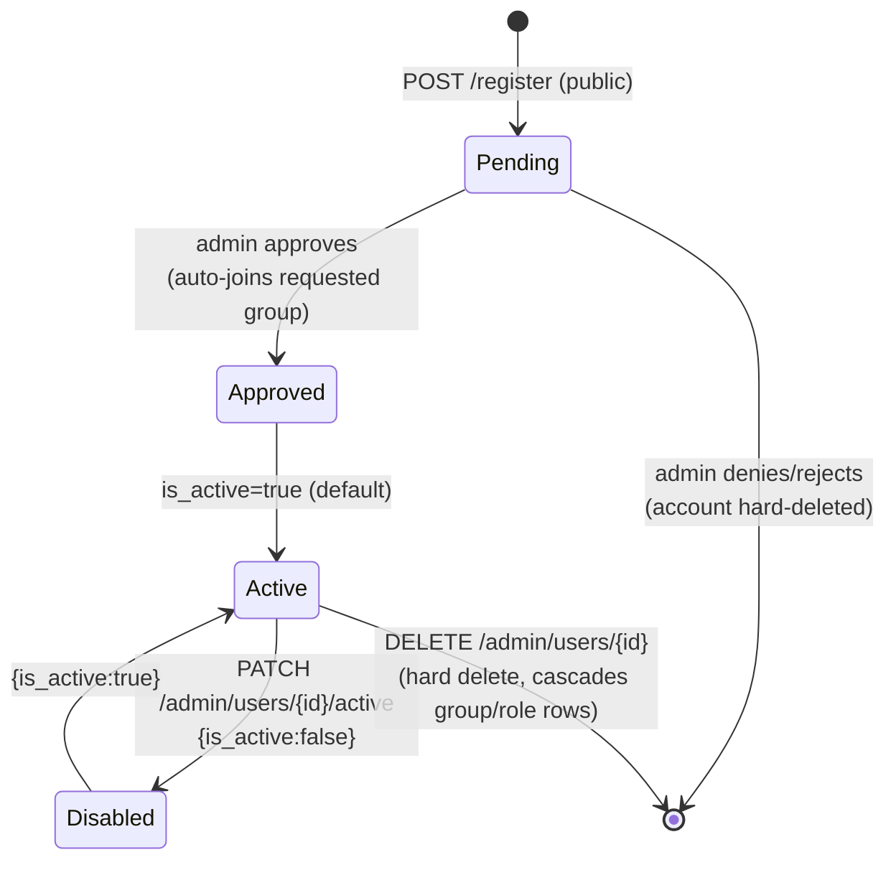
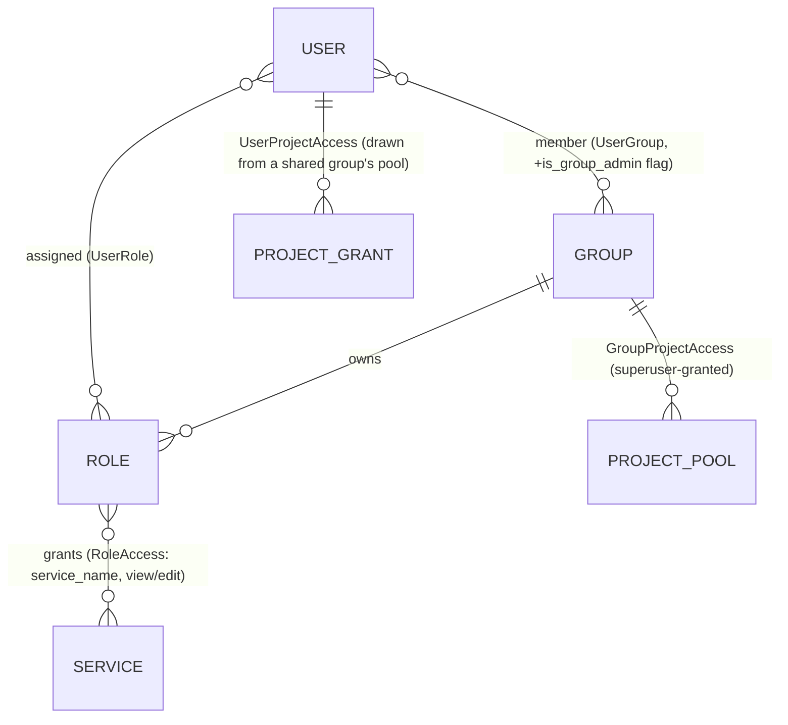
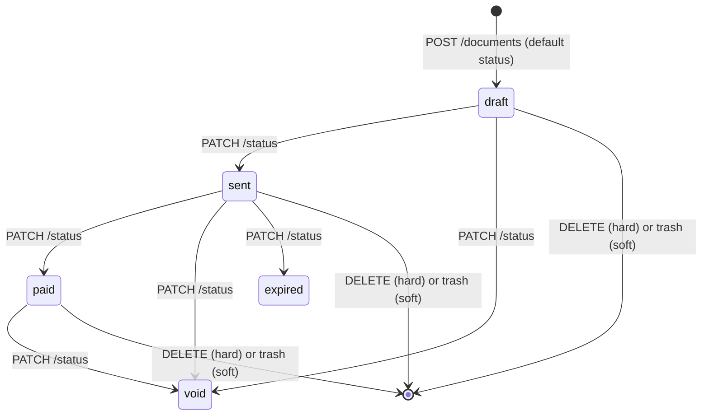
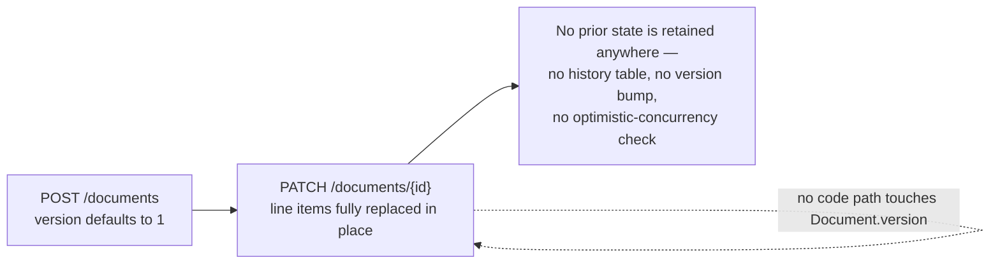
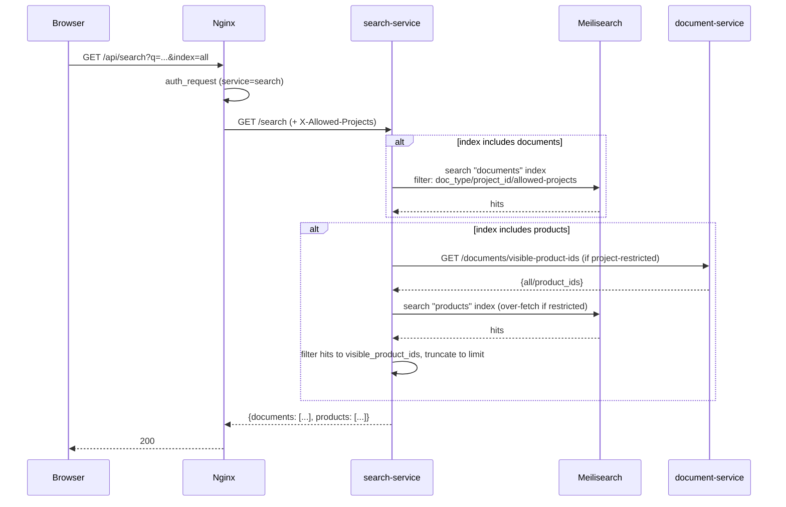
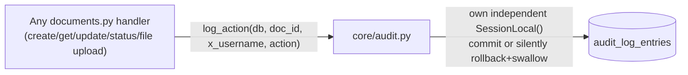

# Business Domain & Workflows

## Core business entities

| Entity | Owned by | Definition |
|---|---|---|
| **User** | auth-service | A login identity. Belongs to zero or more Groups, is assigned zero or more Roles. |
| **Group** | auth-service | An organizational unit (e.g. a sales team). Owns Roles and a pool of visible Projects. |
| **Role** | auth-service | A named bundle of service-access grants, scoped to one Group. |
| **Document** | document-service | A quotation, invoice, proposal, or catalogue hand-out — the central business object. Has a `doc_number`, a `status`, line items, and belongs to a Customer/Project/Company. |
| **Line Item** | document-service | One row on a Document: either a catalogue Product reference or free-text description + price. |
| **Customer** | document-service | Who a Document is issued to. |
| **Project** | document-service | Groups Documents by initiative/budget year; also the unit that project-level access restriction is scoped to. |
| **Company** | document-service | A supplier profile (the business issuing the document) — logo, seal, contact info; chosen per-document. |
| **Product** | catalogue-service | A catalogue item: SKU, price, category, optional attached file, optional Sub-items. |
| **Category** | catalogue-service | A managed list controlling SKU prefixes and the product-form dropdown. |
| **Sub-item** | catalogue-service | A component Product referenced by a parent "bundle" Product, in a fixed display order. |
| **Audit Log Entry** | document-service | An immutable record of who viewed/edited/changed a specific Document, and when. |

## User lifecycle



Rules, from `services/auth-service/app/routers/auth.py` and `admin.py`:

- Self-registration (`POST /register`) always creates an **unapproved**,
  **non-superuser** account; optionally recording a `requested_group_id` so
  that group's own admin(s) — not only a superuser — can approve it
  (`app/routers/admin.py:33-54`).
  `login` is blocked with a distinct `403` message until `is_approved` is
  true (`app/routers/auth.py:100-104`).
- Approving a request that named a group **auto-adds** the user to that
  group as a regular (non-admin) member (`app/routers/admin.py:79-93`).
- Denying/rejecting a pending request **hard-deletes** the account —
  there's nothing else attached to it yet since it was never approved
  (`app/routers/admin.py:96-153`).
- `is_active` is a separate, reversible "suspend" switch, distinct from
  approval — a disabled account is blocked at both `/login` and on every
  subsequent request via `get_current_user`/`/verify` re-checking
  `is_active` (`app/core/deps.py:35-38`, `app/routers/auth.py:106-107,
  155-156`) — so disabling someone cuts off an already-issued, unexpired
  token immediately, not just future logins.
- A superuser account can only be created by another superuser
  (`POST /api/auth/users`) or seeded on first boot if `users` is empty —
  there is **no endpoint to promote a regular user to superuser**;
  `edit_user`/`remove_user`/`set_user_active` all explicitly refuse to
  touch a superuser's account unless the caller is also a superuser
  (`app/routers/admin.py:263-264, 318-319, 358-359`).
- A group admin can remove a user **from their group** (which also drops
  any roles held via that group) but cannot delete the account outright
  unless they are also a superuser — "remove from group" and "delete
  account" are deliberately different operations (see
  [decisions.md](decisions.md)).

## Permission model



The five services a Role can grant access to: **`documents`, `products`,
`search`, `audit-log`, `categories`** (`VALID_SERVICES`,
`services/auth-service/app/routers/admin.py:16`). Only `documents`
distinguishes `view` vs. `edit` (`RoleAccess.access_level`) — the other four
are all-or-nothing. Note that the Nginx gateway tags `/api/customers`,
`/api/companies`, and `/api/projects` with the **same** `documents` service
name (`infra/nginx/nginx.conf:97-127`) — there is no separate
"customers"/"projects"/"companies" grant; access to those follows whatever
`documents` access a role has, `view`/`edit` included.

**Resolution rules** (`services/auth-service/app/core/authz.py`):

- **Superuser** bypasses every check: full access to every service at
  `edit` level, and `ALL` projects.
- **Service access**: granted if *any* of the user's roles is active, in
  an active group, and has a `RoleAccess` row for that service. A
  disabled role or a disabled group's roles are treated as if they
  weren't assigned at all.
- **Access level**: "most permissive wins" — if any qualifying grant for
  `documents` is `edit`, the user gets `edit` overall, even if another
  role only grants `view`. If a service is granted but no `access_level`
  can be found for it at all (a defensive fallback, not expected to
  actually happen in normal use), it defaults to `edit`.
- **Project visibility**: **opt-in restriction**. A user with **zero**
  `UserProjectAccess` rows sees **every** project's documents/products
  (unrestricted — matches the system's original, pre-project-scoping
  behavior). Once at least one grant exists, only those projects (plus
  anything with no project at all) are visible.
- **Granting project access is two-tiered**: a superuser adds a project
  to a **group's pool** (`GroupProjectAccess`); a group admin can then
  grant any project **already in a shared pool** to an individual member
  (`UserProjectAccess`) — a group admin can never hand out a project
  their group doesn't have.

This is enforced centrally, once per request, in `auth-service`'s `/verify`
— see [architecture.md](architecture.md#permission-authorization-flow) for
the full flow and the header names each downstream service trusts.

## Document lifecycle



- `doc_type ∈ {quotation, invoice, proposal, catalogue}` — free text at the
  DB layer, not validated against a fixed set anywhere in
  `documents.py` (only `status` and `currency` are validated with an
  explicit allow-list — `VALID_STATUSES`, `VALID_CURRENCIES`,
  `services/document-service/app/routers/documents.py:35-36`).
  `catalogue` as a `doc_type` is a distinct concept from the `catalogue`
  **export** (a zip of files) or the `catalogue-service` — it just means
  "a document used as a catalogue hand-out."
- **Status transitions are unconstrained** — `PATCH
  /documents/{id}/status?new_status=X` accepts any transition as long as
  `X` is one of the five known values; there is no state machine
  preventing, say, `void → paid`. Treat the diagram above as *typical*
  usage, not an enforced rule — **not verified** as an intentional
  business rule vs. simply unimplemented.
- **Numbering**: `{company.short_name or "DOC"}-{YYYYMMDD}/{seq:03d}`,
  sequential per company **and calendar day**
  (`services/document-service/app/routers/documents.py:108-132`). The
  frontend can preview the next number via `GET /documents/next-number`
  before submitting, but this doesn't reserve it — a genuine two-person
  race is resolved by a `409` on the loser, not silent duplication
  (`IntegrityError` handling in `create_document`).
- **Line items**: on create/full-update, each item either references a
  catalogue `product_id` (server fetches the product's name/price as
  defaults, `422`/`502` if that fails) or supplies its own
  `description`+`unit_price`. `subtotal`, `tax_total`, and `total` are
  always server-computed, never trusted from the client.
- **Soft delete / recycle bin**: `is_deleted` hides a document from the
  main list and search but keeps it recoverable via `PATCH
  .../trash` → `PATCH .../restore`. `DELETE` (hard) is only ever invoked
  from the recycle-bin UI and permanently removes the row, cascading its
  line items and audit log entries, and removing it from the search
  index.

## Document upload flow

```mermaid
sequenceDiagram
    participant B as Browser
    participant N as Nginx
    participant D as document-service
    participant M as MinIO

    B->>N: POST /api/documents/{id}/file (multipart)
    N->>N: auth_request (service=documents)<br/>forwards X-Access-Level
    N->>D: POST /documents/{id}/file
    D->>D: _require_edit_access(X-Access-Level)<br/>403 if view-only
    D->>D: lookup document (404 if missing)
    D->>D: _sanitize_filename(file.filename)
    D->>M: upload_fileobj(bucket, "{doc_type}/{doc_number}/{filename}")
    D->>D: doc.file_object_key = key; commit
    D->>D: log_action(db, doc.id, username, "file_uploaded")
    D-->>N: {file_object_key}
    N-->>B: 200
```

Downloading later goes through `GET /documents/{id}/file-url`, which returns
a MinIO **presigned URL** (signed against the *public* endpoint, not the
internal Docker hostname — see [Storage strategy](#storage-strategy)) rather
than proxying the file bytes through document-service itself. The same
upload/presign shape is used for product files
(`catalogue-service/app/routers/products.py`) and company logo/seal uploads
(`document-service/app/routers/companies.py`), each writing into their own
service's bucket with their own key prefix.

## Version flow



There is no version flow to document beyond this: the `version` column is
inert. See [Versioning workflow](#versioning-workflow) below for the full
explanation and [known-issues.md](known-issues.md) for the implications
(concurrent edits silently overwrite each other).

## Versioning workflow

**There is no implemented versioning workflow.** `documents.version`
(`Integer, default=1`) exists on the model and is returned in `DocumentOut`,
but a repository-wide search confirms **it is never read from or written to
anywhere outside its own column definition** — no endpoint increments it, no
history table stores prior versions, and no UI element in `web/index.html`
displays it. Editing a document (`PATCH /documents/{id}`) fully replaces its
line items in place with no record of the prior state, and there is no
optimistic-concurrency check using this column (two concurrent edits will
silently last-write-wins). Treat `version` as dead/reserved schema — see
[known-issues.md](known-issues.md).

## Approval workflow

The only "approval" concept in the system is **user registration approval**
(covered under [User lifecycle](#user-lifecycle) above) — there is no
document approval/sign-off workflow (no "submitted for approval," "approved
by," or similar states on `Document`). The closest related concept is the
document `status` field, which is a free status label, not an approval gate.
**Not verified from repository**: any deeper approval process was intended
or planned.

```mermaid
sequenceDiagram
    participant U as Prospective user
    participant A as auth-service
    participant Admin as Group admin / superuser

    U->>A: POST /register {username, password, requested_group_id?}
    A-->>U: 201 "pending administrator approval"
    Admin->>A: GET /admin/users/pending
    A-->>Admin: [{username, requested_group_id, ...}]
    alt approve
        Admin->>A: POST /admin/users/{id}/approve
        A->>A: is_approved=true; add to requested group if any
        A-->>Admin: {added_to_group: true/false}
    else deny/reject
        Admin->>A: POST /admin/users/{id}/deny
        A->>A: hard-delete the account
        A-->>Admin: 204
    end
```

## Search workflow



- Indexing is **synchronous and best-effort**: `document-service` and
  `catalogue-service` push a record to Meilisearch inline within the same
  request that creates/updates the row
  (`app/core/search_client.py:index_document`/`index_product` in each
  service) and only log a failure — they never raise, so a Meilisearch
  outage does not block document/product creation, but does leave that
  record un-searchable until its next write. There is **no background
  reindex job or write-behind queue**.
  Deletes call `remove_*_from_index` to avoid stale "ghost" search hits.
- `document-service` and `catalogue-service` each declare their own
  index's filterable attributes on their *own* startup
  (`doc_type, status, customer_id, project_id` for documents;
  `category` for products) — if the owning service hasn't booted at
  least once since the Meilisearch volume was created, filtering on
  those attributes will fail.
- Filter values are always escaped
  (`_escape_filter_value`/`_escape_filter_value`, present in both
  `search-service` and the two indexing services' query paths) before
  being interpolated into a Meilisearch filter string — closes a filter-
  injection vector that was present before commit `b6687c9`.

## Audit logging



- Recorded actions: `created`, `viewed`, `edited`, `status_changed`,
  `file_uploaded` (`services/document-service/app/routers/documents.py`,
  every call site). There is **no** `deleted`/`restored`/`trashed` action
  logged — soft-delete, restore, and hard-delete are silent with respect
  to the audit log.
- `log_action()` deliberately opens its **own** `SessionLocal()` rather
  than reusing the caller's `db` session
  (`services/document-service/app/core/audit.py:7-30`) — fixed in commit
  `bdf21bf` specifically because committing/rolling back the caller's
  shared session from inside the audit helper could force-commit or
  silently discard whatever else the caller still had pending. It also
  never raises — a logging failure can never block the real operation.
- `username` is stored as a plain string snapshot at the time of the
  action (not a foreign key — document-service has no access to
  auth-service's database), so a later user rename does not retroactively
  change historical audit entries.
- Visible only via `GET /documents/{id}/audit-log`, gated on the
  `X-Has-Audit-Log` header, itself derived from whether any of the
  caller's active roles grant the `audit-log` service
  (`app/routers/documents.py:585-609`).

## Storage strategy

- **Two MinIO buckets**, one per owning service: `documents`
  (document-service) and `products` (catalogue-service) — bucket names
  configured via `MINIO_BUCKET` in each service's `.env`, created on
  startup if missing (`ensure_bucket_exists()` in each `storage.py`).
- **Object key conventions** (all under the owning service's single
  bucket):
  - Document files: `{doc_type}/{doc_number}/{sanitized filename}`
  - Company logos: `company-logos/{company_id}/{filename}`
  - Company seals: `company-seals/{company_id}/{filename}`
  - Product files (single upload or bulk import): `{sku}/{filename}`
- **Two S3 clients per service** — an internal one
  (`minio:9000`, the Docker network hostname) for server-side
  upload/download, and a **separate** one pointed at
  `MINIO_PUBLIC_ENDPOINT` (default `localhost:8080`) used **only** to sign
  presigned URLs, because a browser cannot resolve the internal Docker
  service name (`app/core/storage.py` in both catalogue-service and
  document-service — the comment in document-service's version explains
  this most fully). As of `docs/SECURITY_HARDENING_LOG.md` Task 3, this
  points at Nginx (port `8080`), not MinIO's own port directly — MinIO is
  no longer published to the host, so Nginx proxies presigned requests
  through to it (`/documents/`, `/products/` locations in
  `infra/nginx/nginx.conf`) with the path and Host header preserved
  exactly, since both are part of what the SigV4 signature covers.
- **Filename sanitization**: uploaded filenames are stripped of any
  directory component and non-`[A-Za-z0-9._-]` characters replaced with
  `_` before being used in an object key (`_sanitize_filename`, present
  in `documents.py` and `companies.py`) — prevents path traversal into
  another object's key space.
- **Company logo/seal standardization**: raster images (not SVG) are
  resized to fit and padded onto a fixed-size transparent canvas (400×200
  for logos, 300×300 for seals) via Pillow, always re-saved as PNG, so
  every company's letterhead renders consistently regardless of the
  source image's dimensions (`companies.py:55-85`). SVGs are left
  untouched and are always served with a forced `Content-Disposition:
  attachment` on their presigned URL, rather than being renderable inline
  in the app's own origin (an XSS-via-stored-SVG mitigation) — this
  `force_download` treatment is applied to company logo/seal SVGs only,
  not to document or product file uploads (see
  [known-issues.md](known-issues.md)).
- **Document/product export files are generated on demand, not stored** —
  PDF/XLSX/zip exports are streamed straight back in the HTTP response
  and never written to MinIO.
